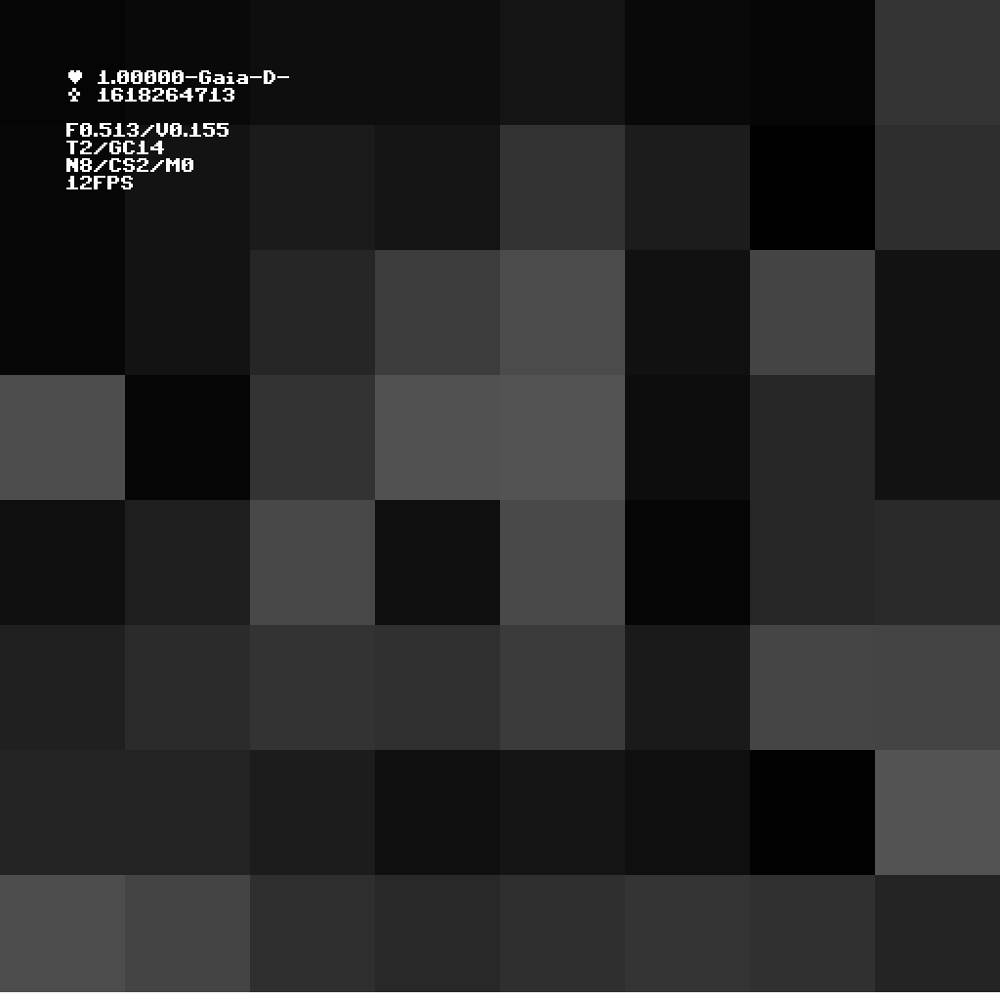

# Desert wanderer

## 1 Configure hyperparameters

Presented on the top of `desert.py` script

- `N` — Quant per dimension
- `void` — void strength
- `eternity` — Iteration limit
- `rs` — world number
- `gaia` — Gaia-Medeja dychotomy
- `comsize` — center of mind size
- `godfinger` — Universe startingpoint (must be inside of center of mind)
- `fom` — **frequency of mind** (Pogoria variable)

## 2 Run

Enter `desert.py` in the terminal

## 3 Observe

Open `foo.png` in *Atom*.

---

